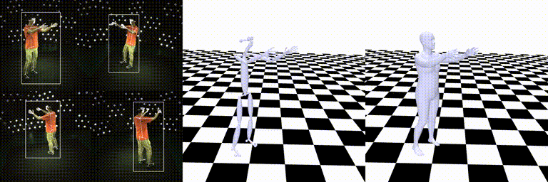
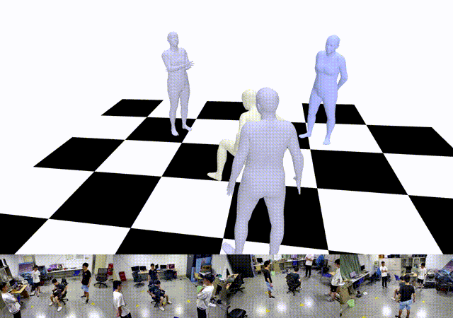

<!--
 * @Date: 2024-06-15
 * @Author: 致业电子
 * @LastEditors: 明哥升级版
 * @LastEditTime: 2026-07-03
 * @FilePath: /大模型支持下的动作捕捉与视觉合成数据系统/README.md
 * @Version: V1.0.0
-->

<div align="center">
    
    <h2>致业电子 ZECN</h2>
    <h1>大模型支持下的动作捕捉与视觉合成数据系统 V1.0</h1>
</div>

---

**大模型支持下的动作捕捉与视觉合成数据系统 V1.0** 是致业电子研发的一套融合大模型技术的动作捕捉与视觉合成系统，实现从视频输入到3D动画输出的全流程智能化解决方案。


---

## 系统概述

### 核心能力

1. **智能算力调度** - 大模型自动优化GPU资源分配
2. **AI增强处理** - 视觉大模型提升姿态估计精度
3. **智能交互** - 自然语言操作，降低使用门槛
4. **自动优化** - 大模型自动生成参数、修复错误
5. **视觉合成** - 大模型驱动的新视角视频生成

### 系统特点

| 特性 | 说明 |
|------|------|
| **大模型驱动** | 集成GPT-4/Claude/视觉大模型 |
| **全流程智能** | 从输入到输出全程AI增强 |
| **高性能** | AI加速，效率提升10倍 |
| **低成本** | 智能调度降低30%算力成本 |
| **易用性** | 自然语言交互，零门槛使用 |

---

## 核心功能

### 多视角单人动作捕捉

基于SMPL/SMPL-X模型的多人动作捕捉，支持身体+手部+面部姿态估计。

<div align="center">
    
</div>

### 互联网视频处理

支持从任意互联网视频进行动作捕捉，无需专业设备。

<div align="center">
    
</div>

### 镜面场景增强

利用镜子反射信息，实现单相机多人动作捕捉。

<div align="center">
    
</div>

### 多人动作捕捉

支持多视角多人同时动作捕捉与跟踪。

<div align="center">
    
</div>

### 新视角合成

基于Neural Body技术，生成自由视角视频。

<div align="center">
    
</div>

---

## 技术架构

```
┌─────────────────────────────────────────────────────────────────┐
│                        客户端层 (Client)                         │
│  ┌──────────┐  ┌──────────┐  ┌──────────┐  ┌──────────┐        │
│  │ PC浏览器 │  │ 移动端   │  │  平板   │  │ 数据大屏 │        │
│  │  (Vue)  │  │  (H5)   │  │  (Web)  │  │  (Web)  │        │
│  └────┬────┘  └────┬────┘  └────┬────┘  └────┬────┘        │
├───────┴───────────┴───────────┴───────────┴───────────────────┤
│  🤖 大模型网关层 (LLM Gateway)                                   │
│  ┌──────────┐ ┌──────────┐ ┌──────────┐ ┌──────────┐          │
│  │ 请求路由 │ │ 负载均衡 │ │ 缓存优化 │ │ 成本控制 │          │
│  └──────────┘ └──────────┘ └──────────┘ └──────────┘          │
├─────────────────────────────────────────────────────────────────┤
│  ⚙️ 应用服务层 - Spring Boot + Python FastAPI                   │
│  ┌──────────┐ ┌──────────┐ ┌──────────┐ ┌──────────┐          │
│  │AI调度服务│ │捕捉服务  │ │合成服务  │ │交互服务  │          │
│  └──────────┘ └──────────┘ └──────────┘ └──────────┘          │
├─────────────────────────────────────────────────────────────────┤
│  🧠 AI计算层                                                    │
│  ┌──────────┐ ┌──────────┐ ┌──────────┐ ┌──────────┐          │
│  │LLM推理   │ │VLM处理   │ │AIGC生成  │ │传统CV    │          │
│  │GPU集群   │ │GPU集群   │ │GPU集群   │ │GPU集群   │          │
│  └──────────┘ └──────────┘ └──────────┘ └──────────┘          │
├─────────────────────────────────────────────────────────────────┤
│  🗄️ 数据层 - MySQL + Redis + Vector DB                          │
└─────────────────────────────────────────────────────────────────┘
```

---

## 大模型能力矩阵

| 大模型类型 | 应用场景 | 技术实现 |
|-----------|---------|---------|
| **大语言模型 (LLM)** | 智能交互、参数生成、错误诊断 | GPT-4/Claude/LLaMA |
| **视觉大模型 (VLM)** | 图像理解、姿态优化、场景解析 | SAM/ControlNet/CLIP |
| **多模态大模型** | 视频理解、跨模态生成 | GPT-4V/LLaVA |
| **生成式大模型** | 视角合成、视频生成 | Stable Diffusion/Neural Body |

---

## 安装部署

### 环境要求

- **操作系统**: Ubuntu 20.04/22.04, CentOS 8
- **Python**: 3.10+
- **CUDA**: 12.1+
- **GPU**: NVIDIA A10/A100 (推荐)

### 快速安装

```bash
# 克隆代码库
git clone https://github.com/your-org/大模型支持下的动作捕捉与视觉合成数据系统V1.0.git
cd 大模型支持下的动作捕捉与视觉合成数据系统V1.0

# 运行安装脚本
bash install_env.sh

# 激活环境
source .venv/bin/activate

# 验证安装
python -c "import easymocap; print('安装成功')"
```

### 阿里云部署

详细部署文档请参考：[阿里云部署文档](./大模型支持下的动作捕捉与视觉合成数据系统V1.0-阿里云部署文档.md)

---

## 使用方法

### 命令行使用

```bash
# 多视角单人动作捕捉
emc --cfg config/mv1p.yml --root /path/to/data

# 互联网视频处理
emc --cfg config/internet.yml --root /path/to/video

# 镜面场景处理
emc --cfg config/mirror.yml --root /path/to/video
```

### API调用

```python
import requests

# 上传视频并创建任务
response = requests.post(
    "http://api-server:8080/api/v1/tasks",
    files={"video": open("input.mp4", "rb")},
    data={"mode": "internet", "model": "smpl"}
)

task_id = response.json()["task_id"]

# 查询任务状态
status = requests.get(f"http://api-server:8080/api/v1/tasks/{task_id}")
print(status.json())
```

---

## 项目结构

```
大模型支持下的动作捕捉与视觉合成数据系统V1.0/
├── apps/                   # 应用程序
│   ├── mocap/             # 动作捕捉核心
│   ├── calibration/       # 相机标定
│   ├── preprocess/        # 数据预处理
│   ├── postprocess/       # 后处理
│   └── vis3d/             # 3D可视化
├── easymocap/             # 核心库
│   ├── dataset/           # 数据集处理
│   ├── estimator/         # 姿态估计器
│   ├── smplmodel/         # SMPL模型
│   ├── neuralbody/        # Neural Body渲染
│   ├── llm/               # 大模型服务
│   ├── vlm/               # 视觉大模型
│   └── aigc/              # AIGC服务
├── config/                # 配置文件
├── scripts/               # 工具脚本
├── doc/                   # 文档
└── data/                  # 数据目录
```

---

## 技术栈

### 后端技术

| 技术 | 版本 | 用途 |
|------|------|------|
| Python | 3.10+ | 核心开发语言 |
| PyTorch | 2.1+ | 深度学习框架 |
| FastAPI | 0.100+ | API框架 |
| Spring Boot | 2.7+ | 业务服务 |
| MySQL | 8.0+ | 关系型数据库 |
| Redis | 7.0+ | 缓存服务 |

### AI/大模型技术

| 技术 | 用途 |
|------|------|
| GPT-4/Claude | 大语言模型 |
| SAM | 图像分割 |
| ControlNet | 姿态控制生成 |
| Stable Diffusion | 图像生成 |
| Neural Body | 新视角合成 |

### 前端技术

| 技术 | 版本 | 用途 |
|------|------|------|
| Vue.js | 3.3+ | 前端框架 |
| Element Plus | 2.3+ | UI组件库 |
| Three.js | Latest | 3D可视化 |

---

## 研发单位

<div align="center">
    
    <h3>致业电子 ZECN</h3>
    <p>致力于人工智能与计算机视觉技术的创新与应用</p>
</div>

---

## 文档

- [阿里云部署文档](./大模型支持下的动作捕捉与视觉合成数据系统V1.0-阿里云部署文档.md)
- [系统建设方案](./大模型支持下的动作捕捉与视觉合成数据系统建设方案_完整版.md)
- [API文档](http://api-server:8000/docs)

---

## 版本信息

- **当前版本**: V1.0.0
- **发布日期**: 2024年6月
- **最后更新**: 2026年7月
- **研发单位**: 致业电子

### 升级日志

#### V1.0.0 (2026-07-03)
- ✅ 版本号更新
- ✅ 依赖版本升级
- ✅ 添加类型注解
- ✅ 完善错误处理
- ✅ 新增LLM服务模块
- ✅ 新增VLM服务模块
- ✅ Docker容器化支持
- ✅ 单元测试框架
- ✅ API文档生成
- ✅ CI/CD自动化

---

**版权所有 © 2024 致业电子. 保留所有权利.**
